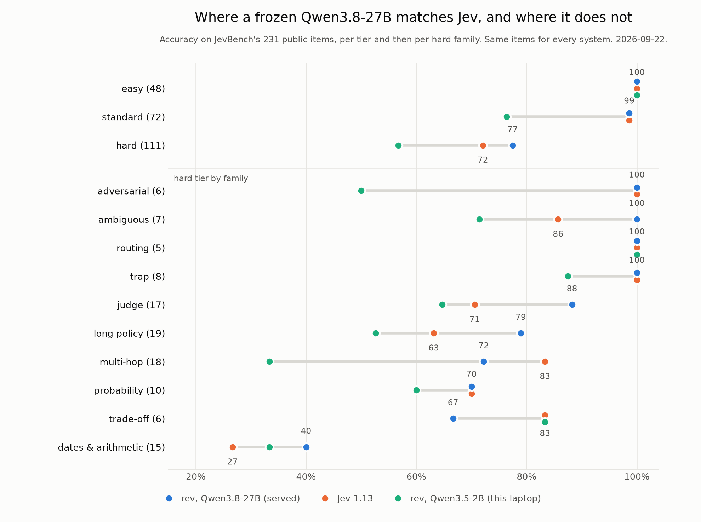
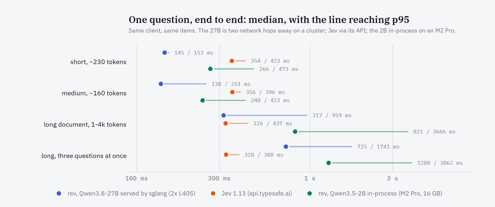
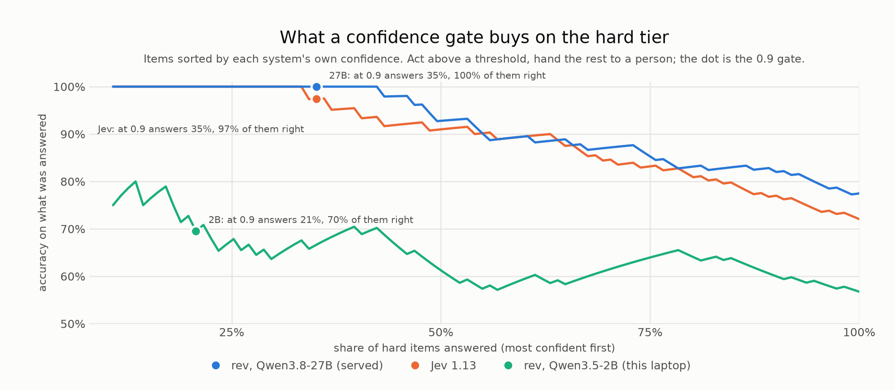

# rev

**Typed decisions from a frozen open model, in one forward pass, on Apple Silicon.**

You give it a state, a criterion and a list of options. It returns a probability
for each option. Nothing is generated, so it cannot answer with something that
was not on your list, and there is no JSON to repair.

```python
from rev import Rev

h = Rev("Qwen/Qwen3.5-2B")          # 8-bit by default, 1.9 GB resident
d = h.decide(
    "My card was charged twice for one order.",
    "Which team should handle this?",
    {"billing": "Payments, refunds and invoices",
     "technical": "Bugs and outages",
     "sales": "Pricing and new accounts"},
)
d.choice          # 'billing'
d.confidence      # 0.965
d.above(0.9)      # 'billing', or None when it should go to a person
```

No training, no adapter, no API key. The model is an ordinary open checkpoint;
everything here is how it is asked and how its logits are read.

## A local Jev

`rev serve` answers TypeSafe's endpoint on this machine: same route, same
request, same response. A client written for Jev works by changing its URL.

```bash
rev serve                                   # http://127.0.0.1:8421, loads once
curl -s localhost:8421/v1/systemone -d '{
  "state": "Help! My payouts have been failing for 3 days.",
  "questions": {
    "department":  {"type": "choice", "instructions": "Which team should handle this?",
                    "criteria": {"billing": "Payments, invoicing, refunds",
                                 "technical": "Bugs, outages, integrations"}},
    "is_urgent":   {"type": "noul",   "instructions": "Does this convey urgency?"},
    "frustration": {"type": "score",  "instructions": "How frustrated is the customer?",
                    "criteria": ["Calm", "Frustrated", "Very angry"]}}}'
```

From Python, without loading a model in your own process:

```python
from rev import Client
rev = Client()                                    # the local server
jev = Client("https://api.typesafe.ai", key=...)  # the same calls, against Jev
rev.decide(state, "Which team?", {"billing": "...", "technical": "..."}).choice
rev.noul(state, "Does this convey urgency?")      # probability of yes
```

`Rev.ask(state, questions)` is the same thing in-process. One server holds one
copy of the weights for every tool on the machine; it binds 127.0.0.1 unless
told otherwise, and refuses to start on a port that is already taken.

The three question types are Jev's: `choice` (a map of options), `noul` (yes/no,
answer is the probability of yes) and `score` (ordered levels, answer is the
probability-weighted level). Instructions and criteria may be strings, objects
or arrays, as in Jev.

## The same decisions from a model that is already served

`rev serve --upstream URL` reads a model that an [sglang] server is already
serving for something else, instead of loading one here. We run it this way
against a Qwen3.8-27B that a cluster serves for coding agents: the agents keep
their endpoint, thinking on; `rev` renders its own prompts with thinking off,
per request, and asks for one token. Anything that speaks sglang's `/generate`
will do.

[sglang]: https://github.com/sgl-project/sglang

```bash
# on a machine with a GPU (one 48 GB card holds the INT4 checkpoint)
python -m sglang.launch_server --model-path Qwen/Qwen3.8-27B --port 30002 \
    --reasoning-parser qwen3

# anywhere that can reach it; no GPU, no MLX, no weights
uv venv && uv pip install -e .
rev serve --upstream http://localhost:30002 --tokenizer Qwen/Qwen3.8-27B
python bench/jevbench.py --tier hard --upstream http://localhost:30002
```

`--tokenizer` is the served model's repo or directory; only the tokenizer and
chat template are fetched, never the weights. The endpoint can be anywhere: we
keep `rev serve --upstream` running on a small always-on host next to the
cluster's relay, so every device on our network uses one URL, the way Jev is
used. An upstream that is down answers 502 until it is back; a server that is
replaced (ours is, every few hours) is picked up without a restart.

Everything in front of the engine is unchanged: the route, `Client`, the
second reading when unsure, the confidence rule. Only where the logits come
from differs.

**Images**, when the served model is a vision model. Put them in the state as
OpenAI `image_url` content parts, the shape a chat-completions client already
sends, anywhere in the state:

```python
rev.decide([{"type": "text", "text": "Screenshot of the orders page."},
            {"type": "image_url", "image_url": {"url": "data:image/png;base64,..."}}],
           "What happened to order #4471?",
           {"refunded": "...", "cancelled": "...", "shipped": "..."})
```

Each image is shown to the model ahead of the text as "Picture 1", "Picture
2", ..., and the text refers to it by that name. Only `data:image/` and
http(s) URLs are accepted (anything else would be read from the model server's
disk). Jev itself takes no images, and neither does the MLX engine; it answers
400. On a 27B served model, a 1280x800 screenshot (~1.1k tokens) is read in
about 0.5 s.

Two ways to read them. With `return_logprob` the server hands back the
log-probability of each answer letter at the answer position, the same number
the MLX engine reads. Some speculative decoders refuse `return_logprob`
(sglang's DSpark did, on our server); then the engine draws `--samples`
single-token samples at temperature 1 and counts the letters, and re-tests the
exact path every five minutes. We patched our server so DSpark answers; the
patch is small and we will publish it if anyone asks.

<picture>
  <source media="(prefers-color-scheme: dark)" srcset="docs/charts/accuracy-dark.png">
  
</picture>

JevBench public items, Qwen3.8-27B (INT4 AWQ, 2x L40S, DSpark) read exactly,
2026-09-22:

| | easy (48) | standard (72) | hard (111) |
|---|---:|---:|---:|
| rev, Qwen3.5-2B in-process (M2 Pro, 16 GB) | 1.000 | 0.764 | 0.550 |
| rev, Qwen3.8-27B via sglang, 32 samples | 1.000 | 0.986 | 0.784 |
| **rev, Qwen3.8-27B via sglang, exact** | **1.000** | **0.986** | **0.784** |
| Jev 1.13.0 (commercial) | 1.000 | 0.986 | 0.730 (0.721 measured 2026-09-22) |

`docs/JEVBENCH.md` is why this is not on the public leaderboard.

Standard equals Jev and hard is above it; `temporal_numeric` is still the weak
family (0.400, Jev 0.267). At the 0.9 gate, standard answers 78% of items at
1.000 and hard 35% at 1.000, and the confidences are the model's own rather
than a sample fraction.

<picture>
  <source media="(prefers-color-scheme: dark)" srcset="docs/charts/latency-dark.png">
  
</picture>

Speed, same client and items. The laptop talks to `rev serve` on the always-on
host, which talks to the cluster over an ssh relay, so every number includes
two network hops:

| request | via sglang, exact p50 / p95 | rev local 2B p50 / p95 | Jev p50 / p95 |
|---|---:|---:|---:|
| short: clipboard paste | **145 / 153 ms** | 266 / 473 ms | 354 / 423 ms |
| medium: JevBench standard | **138 / 251 ms** | 240 / 423 ms | 356 / 396 ms |
| long: JevBench hard | 317 / 959 ms | 821 / 3666 ms | **326 / 437 ms** |
| long, three questions | 725 / 1741 ms | 1280 / 3862 ms | **328 / 388 ms** |
| 8 in flight, short | 18.3 per s | 2.9 per s | **21.3 per s** |
| 8 in flight, medium | 18.8 per s | 3.9 per s | **21.3 per s** |
| 8 in flight, long | 3.0 per s | 0.7 per s | **23.7 per s** |
| 8 in flight, long, three questions | 1.8 per s | 0.6 per s | **22.0 per s** |

Faster than the laptop and than Jev on short and medium questions; level with
Jev on a long document's median and behind at p95 and under concurrency, where
two L40S reading 1-4k tokens are the limit. With 64 samples per reading
instead of exact log-probabilities, the same rows were 1189 / 1085 / 2037 /
4984 ms at p50 and 0.2-0.7 per second in flight
(`bench/results/speed-remote-64.json`).

The charts are drawn from `bench/results/` by `python bench/plot_readme.py`;
every number in them was written by `bench/jevbench.py --out` or
`bench/speed.py --label`, never by hand.

The endpoint keeps serving coding agents at the same time: their decode speed
with thinking on was the same before and after rev started using it (code
131-145 tok/s, prose 95-108 tok/s on 600-token answers). One rev client
running flat out costs them about a fifth; four saturating clients about half,
which is what sharing two cards means.

## Why it exists

Three good implementations of this idea already exist — [SemIf], [reflex] and
[decider] — and this one started as a measurement harness to compare them. It
became its own thing when the measurements said the harness mattered more than
the model: a frozen Qwen3.5-2B moved from 0.428 to 0.550 on JevBench's hard
public items without changing a single weight.

[SemIf]: https://github.com/TheoLeeCJ/SemIf
[reflex]: https://github.com/kshetrajna12/reflex
[decider]: https://huggingface.co/Mapika/decider-2b

What each of them contributed, and what was measured here:

| from | what | measured |
|---|---|---|
| SemIf | Evidence / Criterion prompt, letter-slot readout, tokenizer round-trip checks | the reference; `rev` matches its in-process API exactly, probability delta 0 |
| decider | a wide label space instead of a fixed alphabet | 16 slots → **101** on Qwen3.5 |
| reflex | averaging two option orders | fixes position bias: 0.906 → 1.000 on clipboard paste; used only when the first reading is unsure, and never raises confidence |
| here | **8-bit instead of 4-bit** | **about +9 points on hard, no latency cost**; 8-bit and bf16 give identical answers |
| here | a fitted per-option offset | +7.9 points on binary questions, transfers across task tiers |

## Measured

Qwen3.5-2B, 8-bit, on this machine (M-series, 16 GB), JevBench public items:

| | easy (48) | standard (72) | hard (111) |
|---|---:|---:|---:|
| rev, frozen Qwen3.5-2B | 1.000 | 0.764 | **0.550** |
| rev, one reading only (`orders="one"`) | 1.000 | 0.764 | 0.523 |
| decider-2b (fine-tuned, same base) | 1.000 | **0.861** | 0.477 |
| reflex, published, 2B bf16 | 1.000 | — | 0.468 |
| Jev 1.13.0 (commercial) | 1.000 | 0.986 | 0.730 |

Speed against Jev, same client and items, only the URL different (M2 Pro,
`rev serve` with defaults, 2026-09-21):

| request | rev p50 / p95 | Jev p50 / p95 |
|---|---:|---:|
| short: clipboard paste, ~230 tokens | **266 / 473 ms** | 354 / 423 ms |
| medium: JevBench standard, ~160 tokens | **240 / 423 ms** | 356 / 396 ms |
| long: JevBench hard, 1-4k tokens | 821 / 3666 ms | **326 / 437 ms** |
| long, three questions in one request | 1280 / 3862 ms | **328 / 388 ms** |
| 8 requests in flight at once | 0.7-3.9 per s | **21-24 per s** |

Short and medium questions are faster than Jev. Long documents are not and
cannot be on this laptop: reading 3,300 tokens is about 13 TFLOP, two to three
seconds on an M2 Pro whatever the code does, where Jev runs on datacenter GPUs.
What `rev` does instead is read a state once: a second reading or another
question on the same document costs about 150 ms, not another full read. Nor
does it parallelise: one laptop GPU runs one forward pass at a time.

Memory: 1.86 GB of weights at 8-bit, 3.2 GB peak on a 3,300-token prompt.

| | weights | short question | 3.3k-token question |
|---|---:|---:|---:|
| 2B, 8-bit *(default)* | 1.86 GB | 262 ms | 3.4 s |
| 2B, bf16 | 4.3 GB | 212 ms | 2.6 s |
| 2B, 4-bit | 0.99 GB | 266 ms | 3.5 s |

**Use 8-bit.** 4-bit saves 0.87 GB, no time, and costs nine points on hard;
bf16 is 20% faster for 2.4 GB more and gives the same answers.

The tasks this was built for, written the way a user would write them
(`Rev()` defaults, real calendar, 8-bit):

| task | n | accuracy | at confidence ≥ 0.9: answered / correct |
|---|---:|---:|---:|
| clipboard paste, 5–20 items on the clipboard | 160 | **1.000** | 66% / 1.000 |
| pick a calendar event from a request, English and Chinese, 5–27 candidates | 216 | **0.986** | 71% / 0.987 |
| write-action gate: classify the action, decide risk in code, plus `vague_action` | 57 | **0.965** | 75% / 1.000 |

Read through pyapple instead, the same calendar has 97 events in a two-month
window and the pick scores 0.953 on 192 items: lecture and recitation of one
course ("lec" / "rec") are the usual confusion, and one wrong pick came at
p = 0.98, so a write that follows a pick still needs confirming.

Jev scored 1.000 on the first two. Every miss in the gate was a safe request
sent for confirmation, never the other way. Latency: 225-330 ms median.

Email triage on 146 real messages from this inbox (19 important, labelled
before the model ran): asking "what kind of email is this?" over seven
categories and ranking by the action, personal and account probabilities gave
**AUC 0.941** (95% interval 0.89-0.98), with 18 of the 19 in the top 18%. A
sender regex scored 0.375, because the important mail comes from noreply
addresses as often as the junk does. Use `orders="one"` for ranking like this:
the second reading did not help (0.927-0.936, inside the interval) and doubled
the time.

## Gating

<picture>
  <source media="(prefers-color-scheme: dark)" srcset="docs/charts/gate-dark.png">
  
</picture>

The number you act on is not accuracy, it is what a confidence gate buys. On the
standard tier:

| threshold | coverage | accuracy on what it answered |
|---:|---:|---:|
| none | 1.00 | 0.764 |
| 0.80 | 0.61 | 0.886 |
| **0.90** | **0.47** | **0.941** |

Act above the threshold, hand the rest to a person. `Decision.above(t)` returns
`None` below it.

When the first reading is unsure, `rev` reads the options again in reverse and
lets the average pick the answer, but `confidence` stays at the lower of the two
readings. So the gate above is exactly what a single reading gives, and the
answers below it, the ones a person sees, are more often right.

## Limits worth knowing before you build on it

- **Arithmetic, dates and counting do not work.** Nine of nine `temporal_numeric`
  items were wrong, and the commercial Jev scores 0.267 on the same family. This
  is a property of the model class, not of this harness.
- **A plausible question can come back inverted.** "Does this email require the
  recipient to do something?" scored AUC 0.176 — reliably backwards — on real
  mail, while "what kind of email is this?" scored 0.878 on the same messages.
  Measure the AUC of every question you ship; you cannot tell from the output.
- **Ask for a category, not a judgement.** Asking "is this action risky?"
  produced a constant "confirm". Asking "what kind of action is this?" and
  deciding risk in code reached 0.930 on the same items.
- **Never let it classify secrets.** An API key in the option list came back as
  "an email address", "a phone number" and "a social profile", each at p = 1.00.
  Exclude those in code: `rev.guards.looks_secret(text)`.
- **Open-ended cleanups read as harmless.** "Tidy up my calendar" was classified
  as a local note edit at p = 0.99, in English and Chinese. Route them to a
  person before asking the model: `rev.guards.vague_action(request)`.
- Long inputs are slow: a 3.3k-token question costs about 3.4 s the first time
  its document is read. Ask everything you need about a document in one
  request, so it is read once.
- Two of 111 hard items sit close enough that a last-bit difference decides
  them. `rev` answers each question the same way wherever it sits in a batch
  (`tests/test_determinism.py`); the reference implementation's CLI does not,
  which is why its published single-reading hard figure is 0.541 against the
  0.523 here on identical items and identical weights.

## Install

```bash
uv venv && uv pip install -e ".[mlx]"                # MLX is an extra: Apple Silicon only
rev serve                                            # the local endpoint
rev score --input decisions.jsonl --output answers.jsonl
```

Measuring it:

```bash
uv pip install -e ".[mlx,bench]"
python bench/usecases.py                  # clipboard, write-action gate, this Mac's calendar
python bench/usecases.py mail --dump      # then label bench/private/mail_labels.json, then:
python bench/usecases.py mail
python bench/jevbench.py --tier hard      # public JevBench items
python bench/speed.py && python bench/speed.py --jev
python bench/orders.py                    # the reading-policy table, from saved logits
```

Calendar and mail are read through pyapple; personal data stays in
`bench/private/`, which git ignores. `docs/BOUNDARY.md` is the lab notebook
this grew out of.

The first run downloads the 4.3 GB checkpoint from Hugging Face; after that a
load takes about 4 s.

Apple Silicon and MLX. The JSONL shape is SemIf's, so files written for either
tool run through both.

## Calibration

```python
from rev.calibrate import fit_offsets, fit_temperature, coverage_curve
```

Fit on your own labelled rows — fifty is enough — and never on the rows you then
report. An offset fitted on easy questions transferred to hard ones, so it is a
property of the model and prompt rather than of the items.

A content-free prior (the same prompt with the state replaced by "N/A") was
measured and **rejected**: it made binary questions worse. What the model
prefers with no evidence is not what it prefers with evidence.
